# Hungry for Giving
## Description
Hungry for giving is an simple CRUD APP planner event for sharing meal events to people in need. As a user of Hungry for Giving app you will be able to participate in share meals events. You can help people in need by signing up as an event host, volunteering or making donations. 

The app assist the host to plan a share meal event to help people in need. When the user sign up as a host is required to fill out a form to plan the details of the event, including the food items that are going to be needed.  The  details of the event are going to be displayed for other users to join the event with donations or and as volunteers. The user-volunteers are going to be able to sign up and leave a message to the host in the event details page. The user-donor will have displayed a list of the food items needed for the event so the donations match then.

## Screenshots
- Home screen 
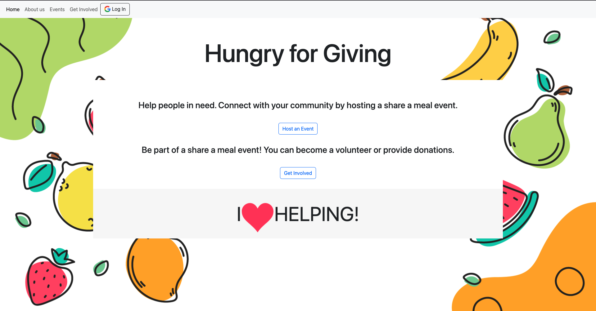
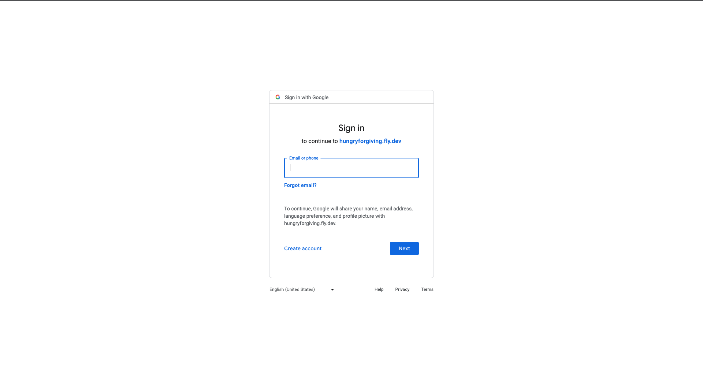
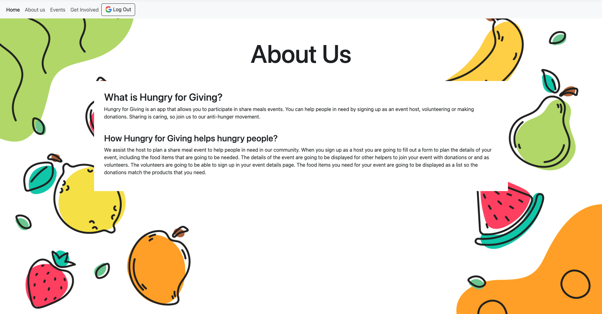
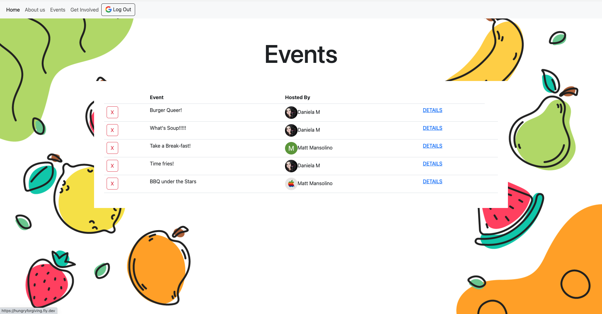
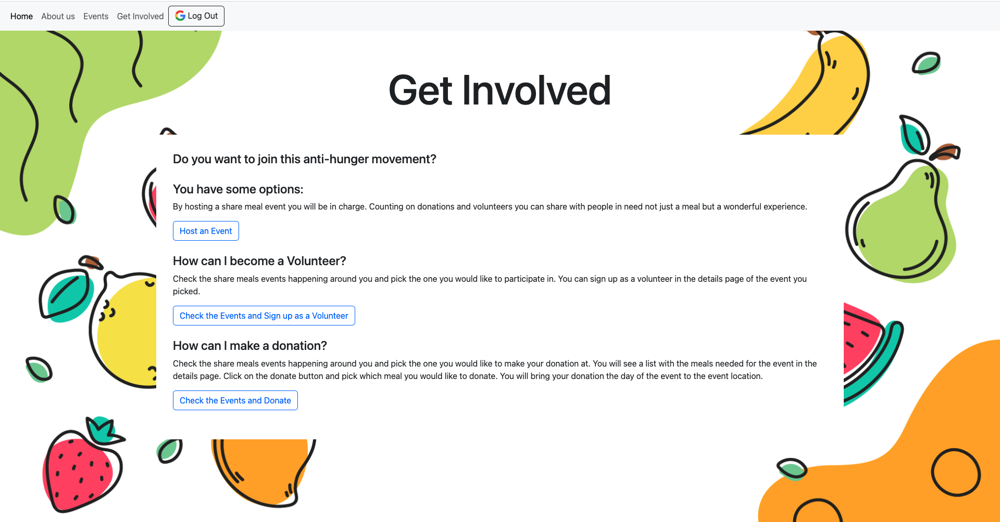
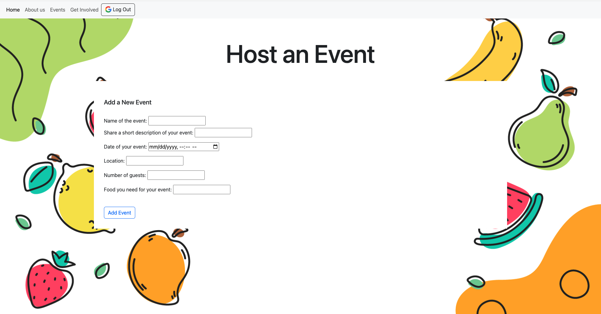
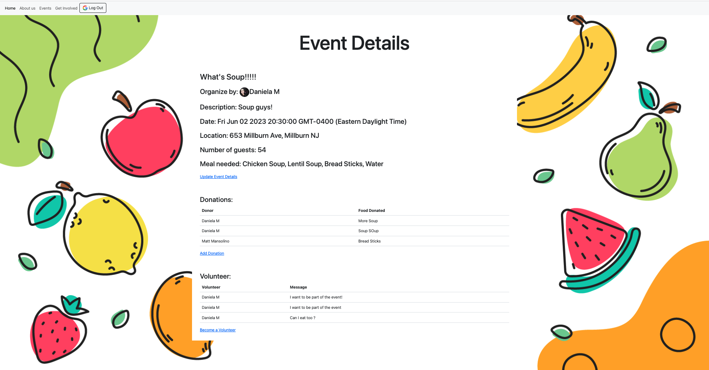
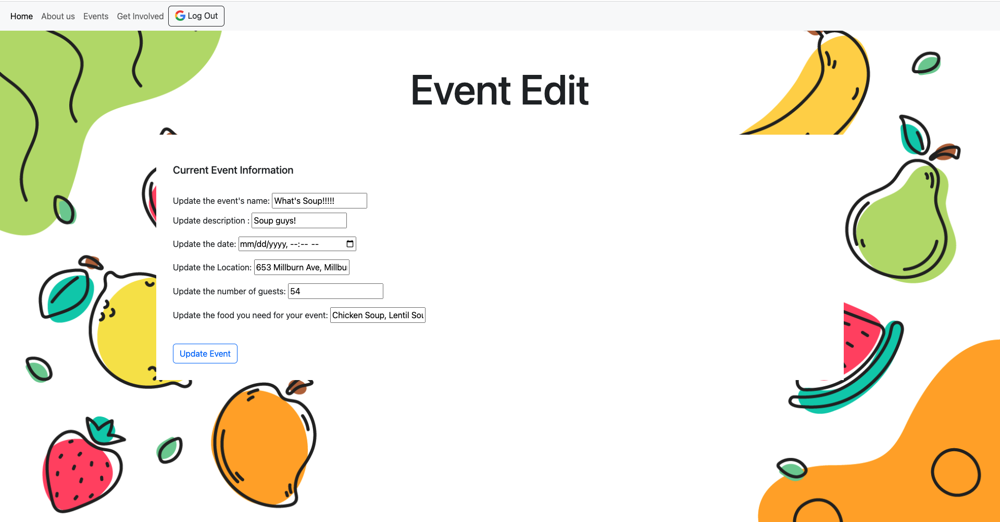
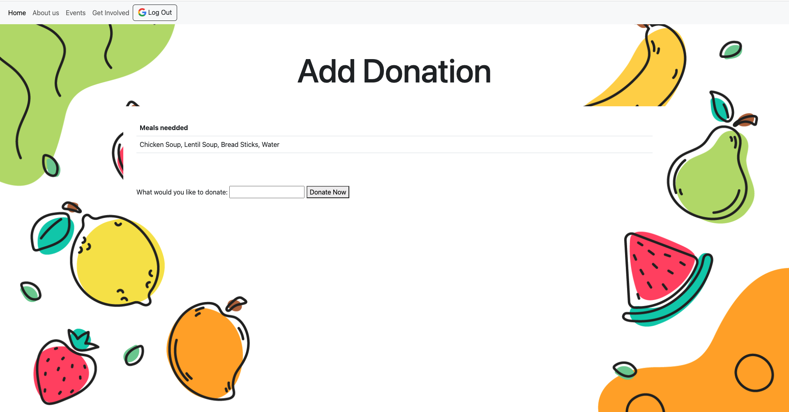
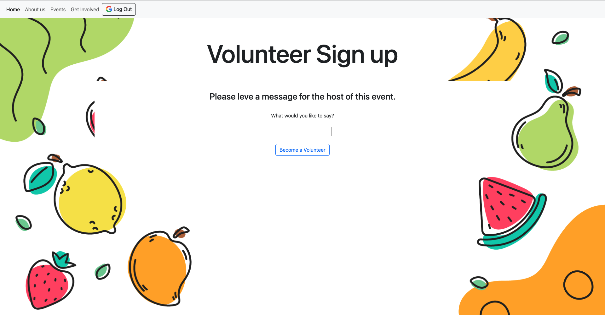
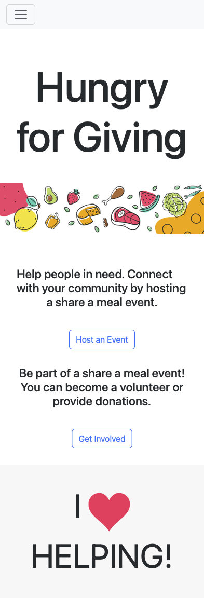
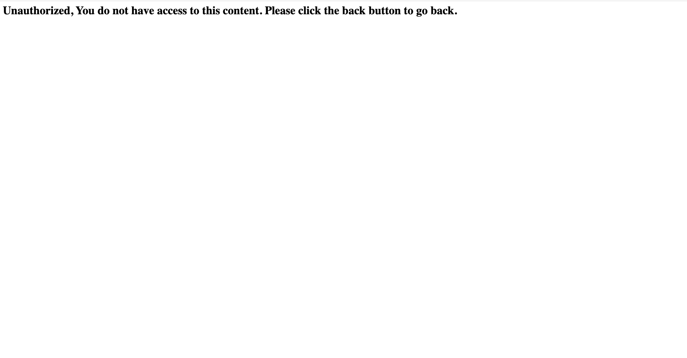
## Technologies Used
- Node
- Express
- Mongo
- Mongoose
- Json
- Google’s OAuth 
- Bootstrap
- JavaScript
- Embedded JavaScript Templating
- Css
- Images courtesy: [freepik](https://www.freepik.com/")

## Getting Started
[Click to go to Hungry for Giving](https://hungryforgiving.fly.dev/)

## Next Steps
- I would like to display with google maps api the adress of the event.
- I would like to personalize the the donations so they can be other items not just food.
- I want to be able to create a second data base for beneficiaries of the donations. 
