# Planning for Hungry for Giving
Hungry for giving is an simple CRUD APP planner event for sharing meal events to people in need. 

## Analyze the app's functionality

[Trello board](https://trello.com/invite/b/B8U2ZYhv/ATTI3b0d353c1f0f3dc7d91e6537abd67e0a0CAAC159/hungry-for-giving-project-2)

## Wireframes
- Home screen 
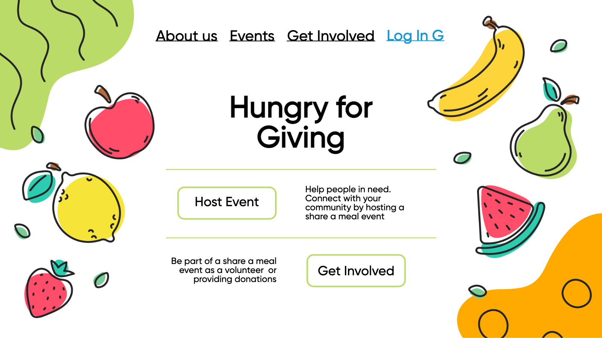
- About Us screen 
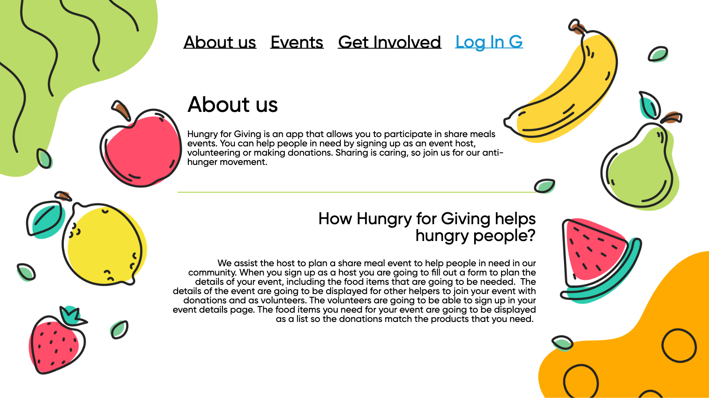
- Events screen 
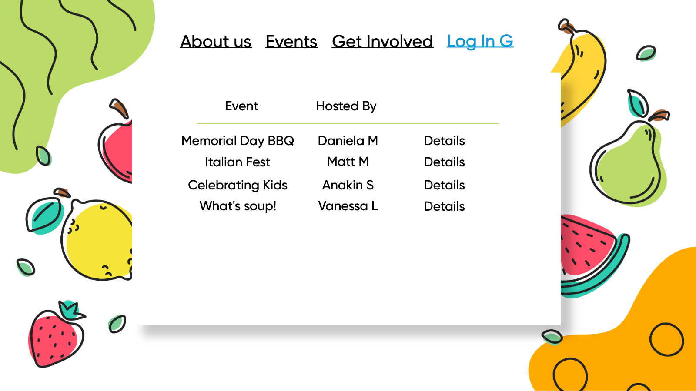
- Event Details screen
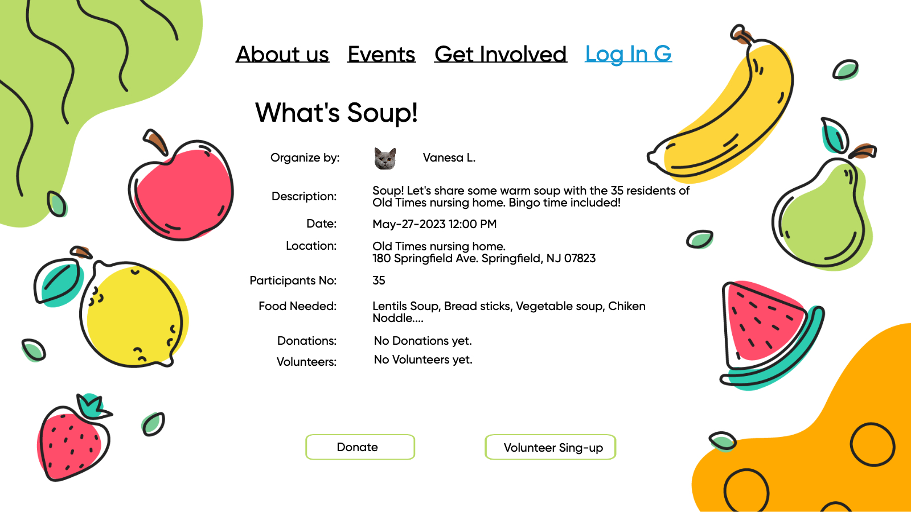
- Event Details with Donor and Volunteers screen
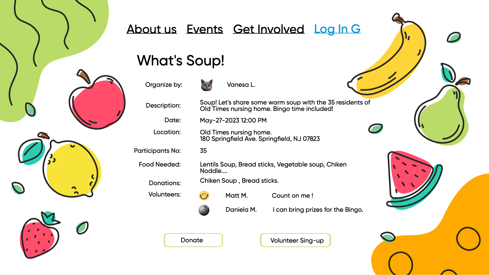
- Get involved
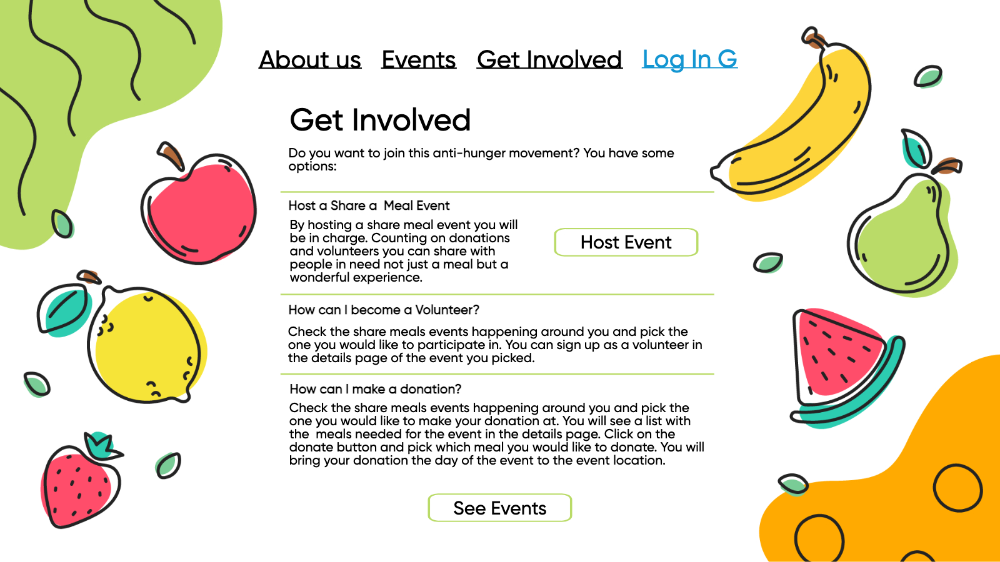
- Host a Event screen
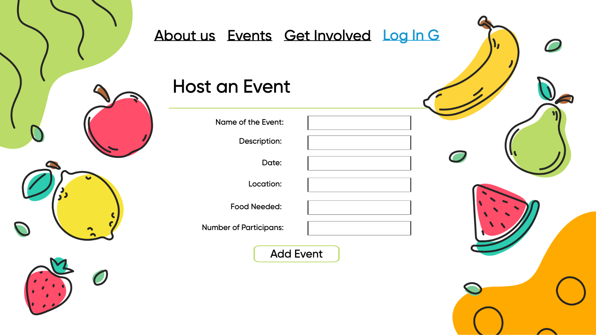
- Donations screen 
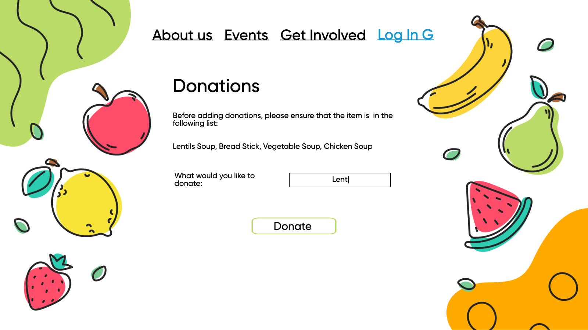
- Volunteer sign- up screen
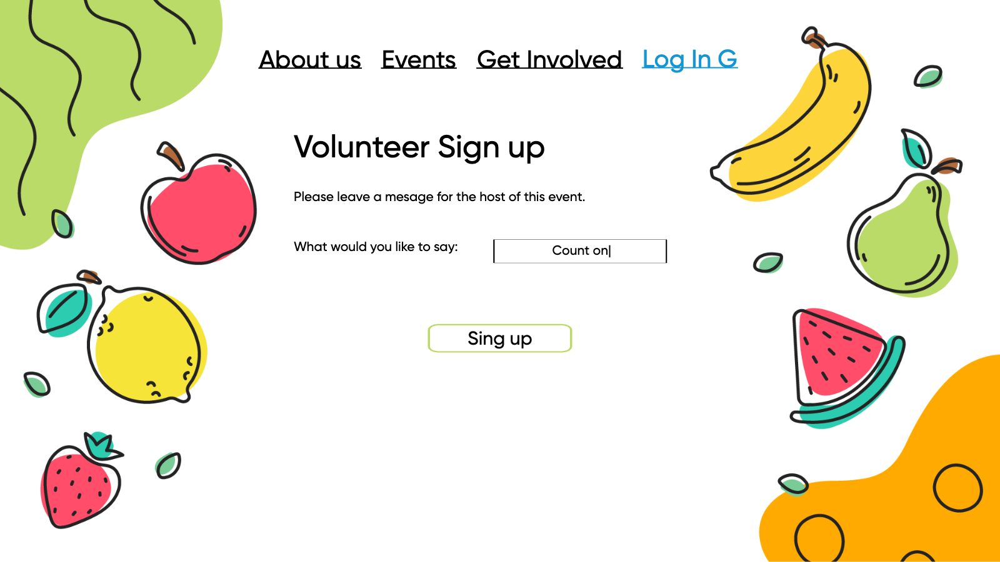
- Log-in screen 
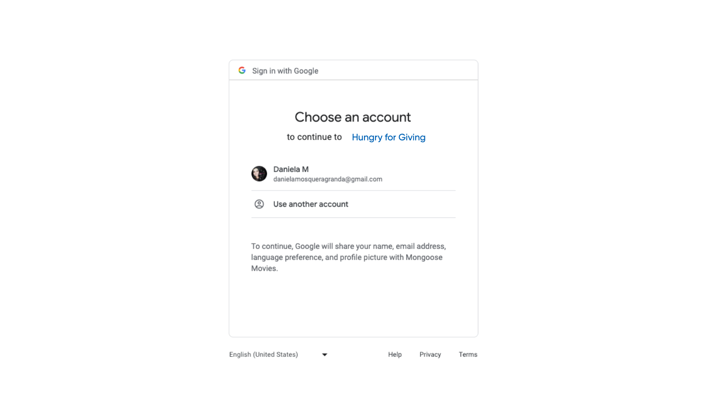

## Entity Relationship Diagram
-Hungry for Giving APP planner event ERD:
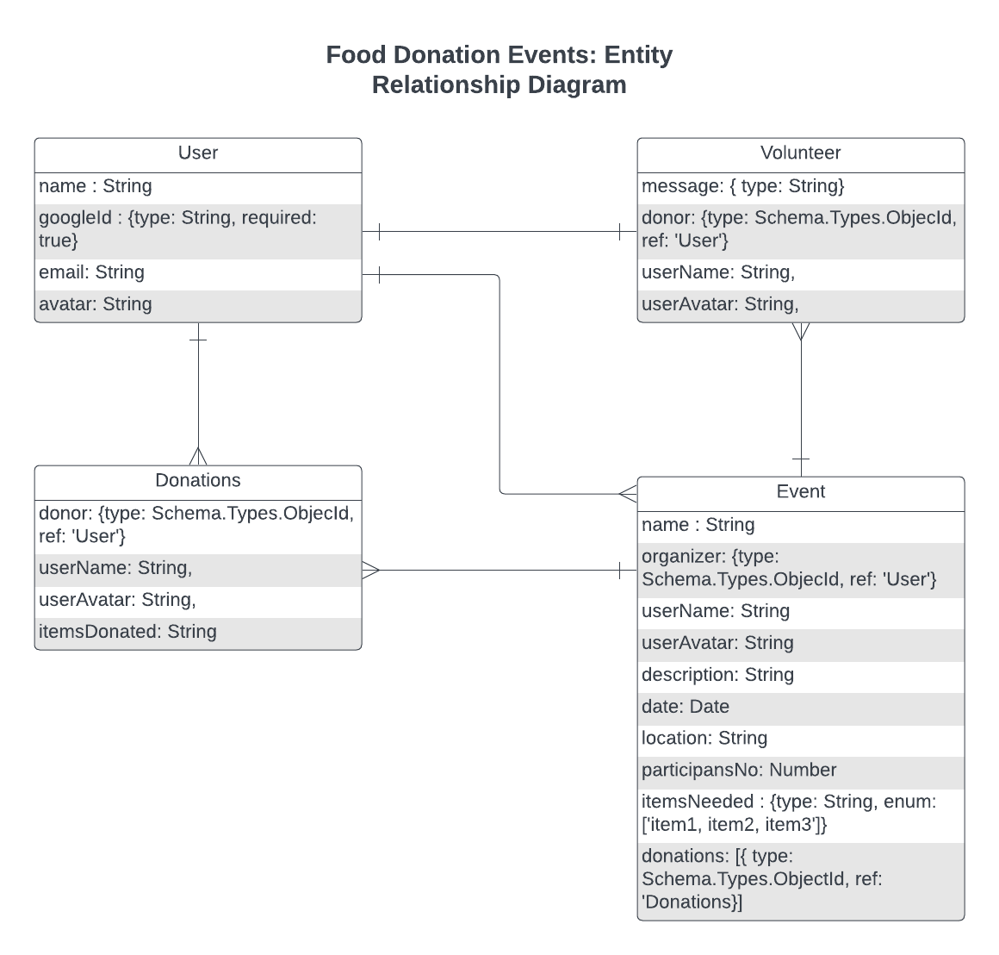
